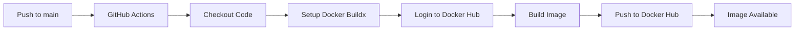
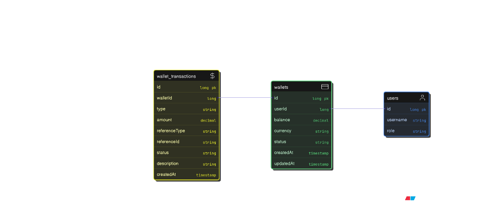

# NukkadSeva Backend

[](https://spring.io/) [](https://java.com/) [](https://www.postgresql.org/) [](https://www.docker.com/) [](https://opensource.org/licenses/MIT)

**NukkadSeva** is a comprehensive local services marketplace that connects service providers with customers in their neighborhood. This backend API powers the entire platform with robust authentication, service management, booking systems, and real-time communication features.

## 🏗️ Architecture Overview

The backend is built as a RESTful API using **Spring Boot 3.3.2** and **Java 17**. It utilizes **PostgreSQL** as its primary database.

### Core Components
- **Framework**: Spring Boot 3.x
- **Authentication**: JWT-based authentication combined with Spring Security.
- **Database ORM**: Spring Data JPA / Hibernate.
- **Mapping**: MapStruct for translating entities to DTOs.
- **Storage**: Azure Blob Storage integration for profile pictures and documents.
- **Real-time Comms**: WebSockets for real-time booking notifications.
- **Email**: Integration with `spring-boot-starter-mail` and FreeMarker for email templates.
- **API Docs**: OpenAPI / Swagger UI.

---

## 🚀 Quick Start

### Prerequisites
- **Java 17**
- **Gradle** (or use the provided Gradle wrapper `gradlew`)
- **PostgreSQL** Database
- Azure Blob Storage Account (or modify application to use local storage mock)

### Configuration
1. Clone the repository
2. Set up your `.env` or application properties. Refer to `src/main/resources/application.yml` for required keys (e.g., `JWT_SECRET_KEY`, database URL, and Azure Connection Strings).

### Running the Application

Using Gradle wrapper:

```bash
# Build the project
./gradlew build

# Run the Spring Boot application
./gradlew bootRun
```

The API will be available at `http://localhost:8080`.
The OpenAPI documentation is accessible at `http://localhost:8080/swagger-ui.html`.

---

## 🐳 Docker Setup (Full Steps)

### Prerequisites
- **Docker** installed and running ([Install Docker](https://docs.docker.com/get-docker/))
- Verify Docker is running:
  ```bash
  docker --version
  docker info
  ```

### Step 1: Create the `.env` File

Before running the container, create a `.env` file in the project root with the following variables:

```env
# JWT CONFIG
JWT_SECRET_KEY=<your-base64-encoded-secret-key>

# AZURE STORAGE CONFIG
AZURE_STORAGE_CONNECTION_STRING=<your-azure-connection-string>
AZURE_BLOB_CONTAINER_NAME=<your-container-name>

# DATABASE CONFIG
DB_URL=jdbc:postgresql://<your-db-host>:5432/<your-db-name>
DB_USERNAME=<your-db-username>
DB_PASSWORD=<your-db-password>

# MAIL CONFIG
MAIL_HOST=smtp.gmail.com
MAIL_USERNAME=<your-email>
MAIL_PASSWORD=<your-app-password>

# APPLICATION CONFIG
APP_BASE_URL=http://localhost:8080

# OAUTH CONFIG
GOOGLE_CLIENT_ID=<your-google-client-id>
GOOGLE_CLIENT_SECRET=<your-google-client-secret>
```

### Step 2: Build the Docker Image

The Dockerfile uses a **multi-stage build** — it compiles the application with Gradle and then packages it into a lightweight JRE image.

```bash
docker build -t nukkadseva-backend .
```

> **Note:** The first build may take a few minutes as it downloads dependencies. Subsequent builds will be faster due to Docker layer caching.

### Step 3: Run the Docker Container

```bash
docker run -d \
  --name nukkadseva-backend \
  --env-file .env \
  -p 8080:8080 \
  nukkadseva-backend
```

The API will be available at `http://localhost:8080`.

### Step 4: Verify the Container Is Running

```bash
# Check container status
docker ps

# View application logs
docker logs nukkadseva-backend

# Follow logs in real-time
docker logs -f nukkadseva-backend
```

### Stopping the Container

```bash
docker stop nukkadseva-backend
```

### Restarting the Container

```bash
docker start nukkadseva-backend
```

### Removing the Container and Image (Full Cleanup)

Use these steps when you need to rebuild from scratch:

```bash
# 1. Stop the running container
docker stop nukkadseva-backend

# 2. Remove the container
docker rm nukkadseva-backend

# 3. Remove the Docker image
docker rmi nukkadseva-backend

# 4. (Optional) Remove all dangling/intermediate images from the build
docker image prune -f

# 5. Rebuild the image
docker build -t nukkadseva-backend .

# 6. Run the new container
docker run -d \
  --name nukkadseva-backend \
  --env-file .env \
  -p 8080:8080 \
  nukkadseva-backend
```

### One-Liner: Remove & Rebuild Everything

```bash
docker stop nukkadseva-backend 2>/dev/null; \
docker rm nukkadseva-backend 2>/dev/null; \
docker rmi nukkadseva-backend 2>/dev/null; \
docker image prune -f; \
docker build -t nukkadseva-backend . && \
docker run -d --name nukkadseva-backend --env-file .env -p 8080:8080 nukkadseva-backend
```

### 🔧 Docker Troubleshooting

| Problem | Solution |
|---|---|
| `COPY failed: no source files were specified` | Build files are excluded by `.dockerignore`. Ensure `gradlew`, `gradle/`, `build.gradle`, `settings.gradle`, and `src/` are **not** in `.dockerignore`. |
| `permission denied` on `gradlew` | The Dockerfile already runs `chmod +x gradlew`. If issues persist, run `git update-index --chmod=+x gradlew` locally. |
| Container starts but app crashes | Check logs with `docker logs nukkadseva-backend`. Ensure `.env` file has correct database credentials. |
| Port 8080 already in use | Stop other services on port 8080 or map to a different port: `-p 9090:8080` |
| Build is very slow | Use Docker BuildKit: `DOCKER_BUILDKIT=1 docker build -t nukkadseva-backend .` |

---

## 📱 Testing from a Mobile Phone (Local Network)

If you want to test the application from your phone while running it on your PC:
1. Connect both devices to the same network (e.g., connect PC to your phone's hotspot).
2. Find your PC's IP Address using `hostname -I` (Linux/Mac) or `ipconfig` (Windows).
3. Run the backend normally (it automatically binds to `0.0.0.0` to accept external traffic).
4. Update frontend `baseURL`: Open `src/lib/api.ts` in the frontend project and set the API URL to your PC's IP:
   ```typescript
   baseURL: "http://<YOUR-PC-IP>:8080/api"
   ```
5. Run the frontend bound to all interfaces:
   ```bash
   npm run dev -- -H 0.0.0.0
   ```
6. Open your phone's browser and go to `http://<YOUR-PC-IP>:3000`.

---

## 📂 Project Structure

```
src/main/java/com/nukkadseva/nukkadsevabackend/
├── config/              # Configuration (Security, OpenAPI, Azure, etc.)
├── controller/          # REST API endpoints
├── dto/                 # Data Transfer Objects
├── entity/              # JPA Entities
├── exception/           # Custom exceptions and Global Exception Handler
├── mapper/              # MapStruct interfaces
├── repository/          # Spring Data JPA Repositories
├── security/            # JWT Filters and security entry points
├── service/             # Business Logic Interfaces & Implementations
└── util/                # Utility classes
```

## 🔌 API Overview

This platform provides dedicated endpoints for:
- `/api/public/**` - Unauthenticated access (e.g., searching for services)
- `/api/login`, `/api/register` - Authentication handlers
- Customers, Providers, and Admin specialized controllers.

Check `/swagger-ui.html` during runtime to inspect and test all API routes directly.

## 🤝 Contributing
1. Fork the feature branch
2. Ensure you adhere to standard Java/Spring Boot conventions
3. Submit a Pull Request.

---

## 🚀 CI/CD: Auto-Deploy to Docker Hub

This project includes a **GitHub Actions pipeline** that automatically builds and pushes the Docker image to **Docker Hub** on every push to `main`/`master`.

### How It Works

```
Push to main/master → GitHub Actions → Build Docker Image → Push to Docker Hub
```

The pipeline (`.github/workflows/docker-publish.yml`):
- ✅ Builds the Docker image using the multi-stage `Dockerfile`
- ✅ Pushes to Docker Hub with tags: `latest`, short commit SHA, and branch name
- ✅ Uses GitHub Actions cache for fast rebuilds
- ✅ On Pull Requests, it **only builds** (no push) to validate the Dockerfile

### Setup Steps

#### Step 1: Create a Docker Hub Account & Access Token

1. Go to [Docker Hub](https://hub.docker.com/) and sign up / log in.
2. Go to **Account Settings** → **Security** → **New Access Token**.
3. Name it (e.g., `github-actions`) and select **Read, Write, Delete** permissions.
4. **Copy the token** — you won't see it again.

#### Step 2: Add Secrets to GitHub Repository

Go to your GitHub repo → **Settings** → **Secrets and variables** → **Actions** → **New repository secret**:

| Secret Name | Value |
|---|---|
| `DOCKERHUB_USERNAME` | Your Docker Hub username (e.g., `yusuf7861`) |
| `DOCKERHUB_TOKEN` | The access token you created in Step 1 |

#### Step 3: Push to Main Branch

```bash
git add .
git commit -m "Add CI/CD pipeline for Docker Hub"
git push origin main
```

The pipeline will automatically trigger. You can monitor it under the **Actions** tab in your GitHub repository.

#### Step 4: Verify on Docker Hub

After the pipeline completes, your image will be available at:
```
docker.io/<your-dockerhub-username>/nukkadseva-backend:latest
```

### Deploying on Any Server

Once the image is on Docker Hub, you can deploy it on **any server** with Docker installed:

```bash
# Pull the latest image
docker pull <your-dockerhub-username>/nukkadseva-backend:latest

# Run the container
docker run -d \
  --name nukkadseva-backend \
  --env-file .env \
  -p 8080:8080 \
  <your-dockerhub-username>/nukkadseva-backend:latest
```

### Pipeline Workflow Overview



---
**Built with ❤️ by the NukkadSeva Team**
